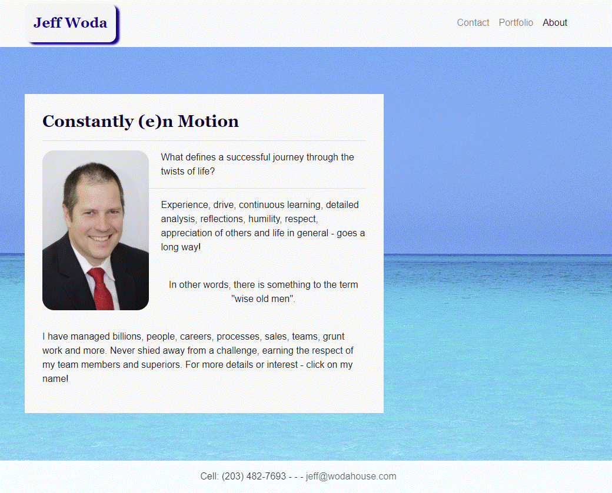
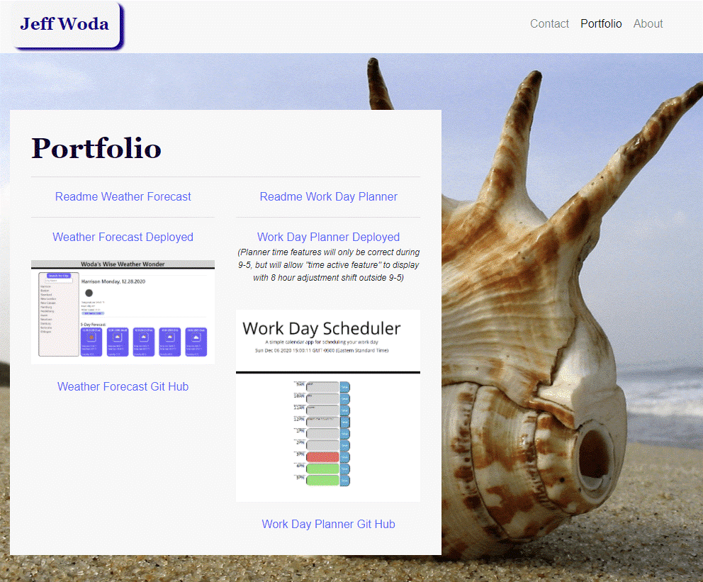
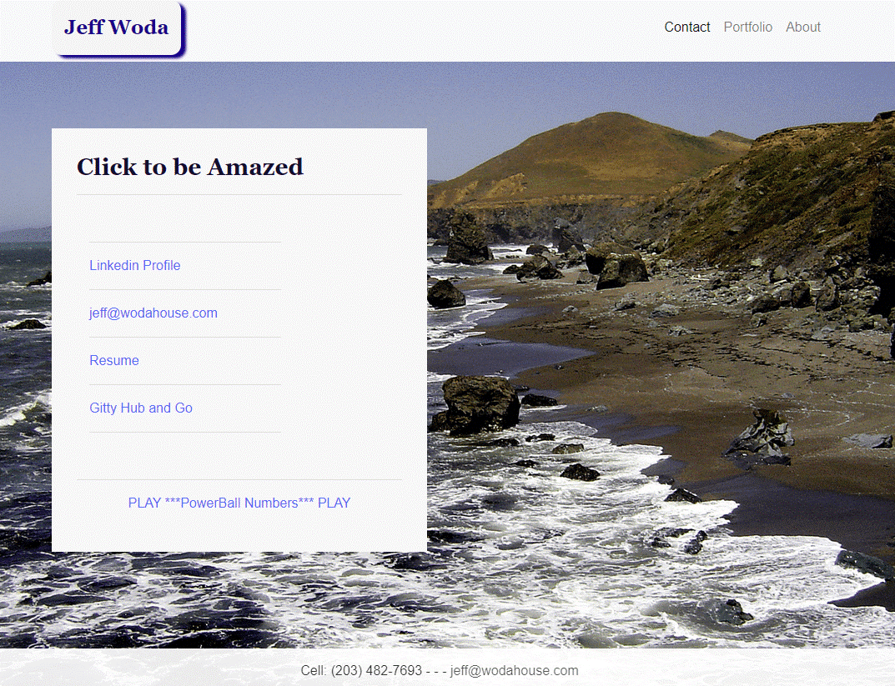
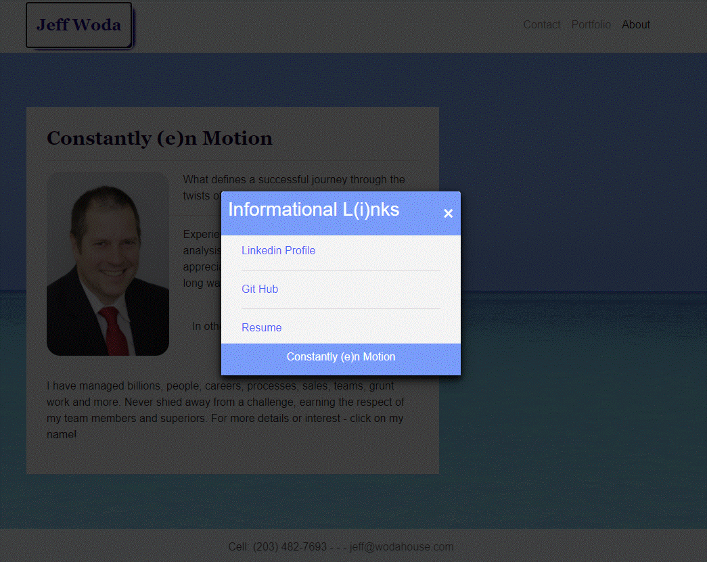

 

---
# Portfolio Informational Interface

## Description 
This serves to promote myself (Jeff Woda) by displaying:

1. Portfolio of Projects

2. Contact Information with links to:
	
	a) Resume
	b) Git Hub
	c) LinkedIn

3. As well as the lottery generator game designed to allow for further random generation to my informational links. 

_(Future development on this issue is to change the auto-forward page feature to an optional Modal to make the point but not the transition for more user friendly approach)_

## Table of Contents

* [Usage](#Usage)
* [Contributing](#Contributing)
* [ScreenShots](#ScreenShots)
* [Questions](#Questions)
* [License](#License)

## Usage 

For informational and promotional purposes.

## Contributing

Contributions are welcomed with proper documentation on their features/add ons.

## ScreenShots

## Questions

Github user name: [wodaje](https://github.com/wodaje)

Contact email: [jeff@wodahouse.com](mailto:jeff@wodahouse.com)

---

© 2020 Wodahouse.com dwyhd (do what your heart desires) license Readme Generator generated!